# Welcome to my Portfolio

## My name is Yazan Alkarabsheh from salt city , I graduated from the university of Jordan in 2017 and holding a degree in electrical engineering , now I am  software developer student at ASAC

>My favortie qoute for programming is : "Testing leads to failure, and failure leads to understanding".

[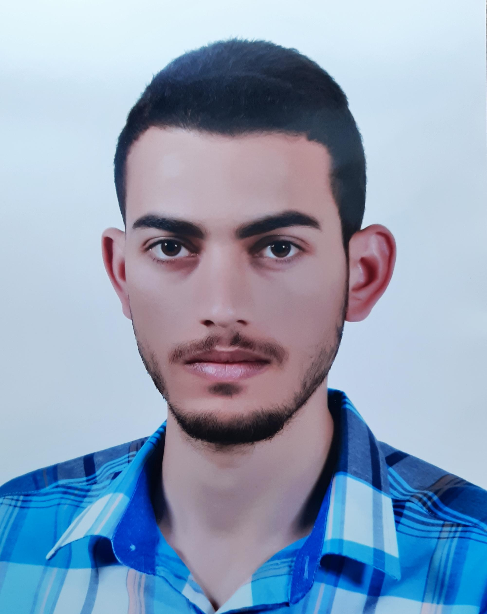](img/yazan2.jpg)
[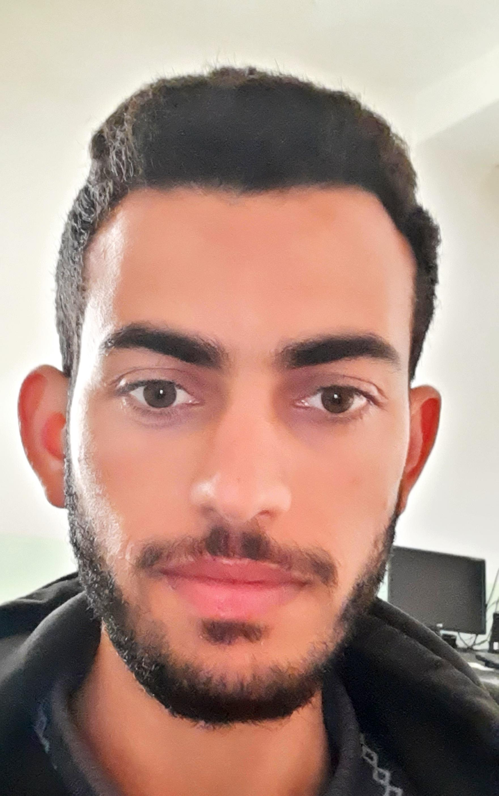](img/yazan2.jpg)

## My Projects in 201 Level

### **Final Project**

#### **Pets Service Center**

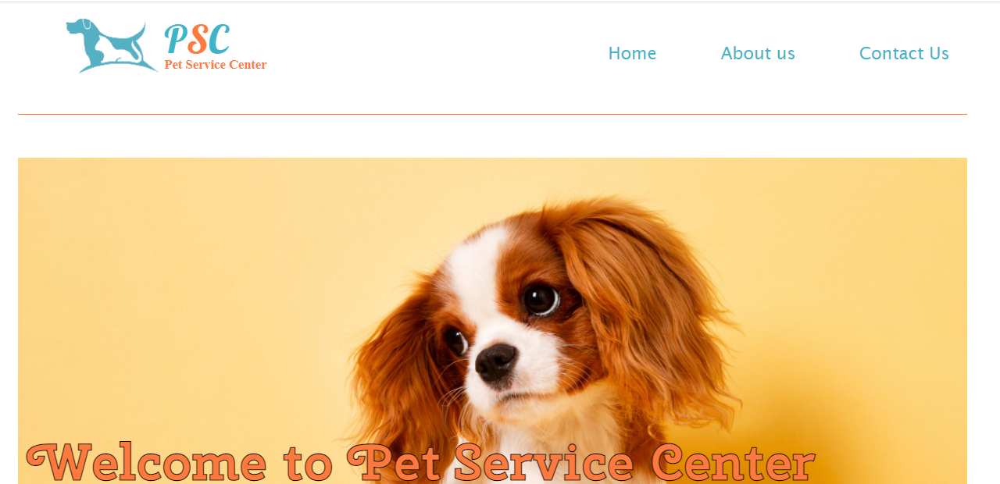
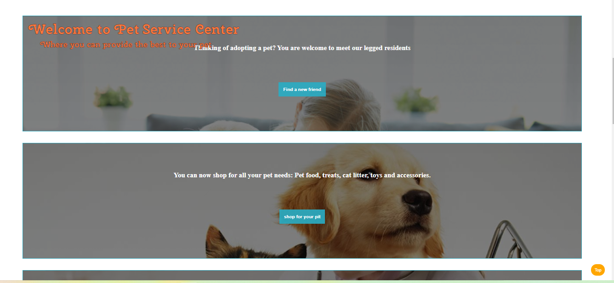
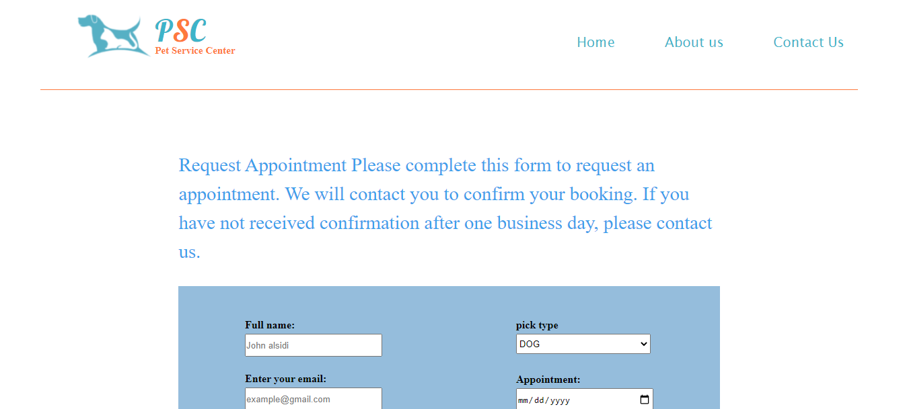
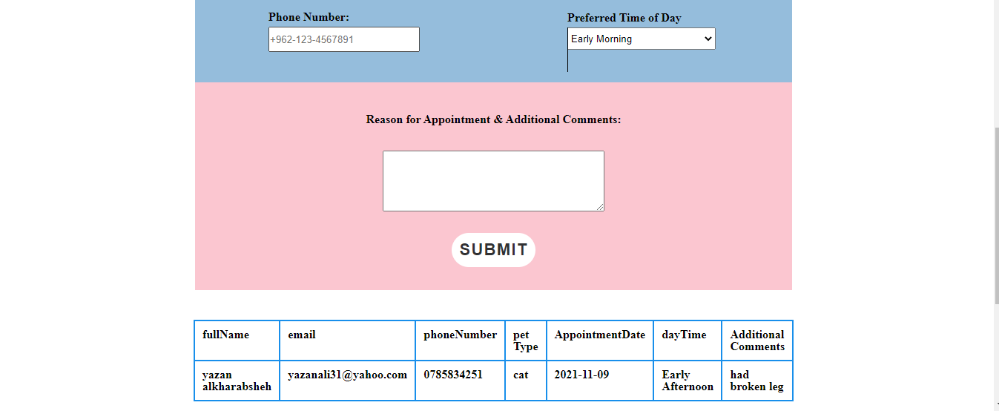
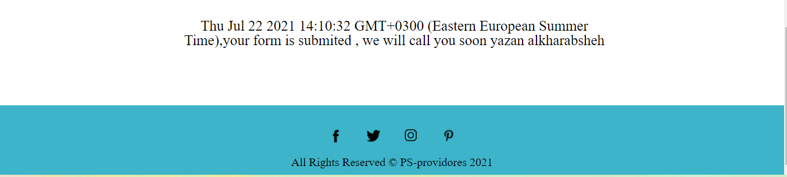

### **Buss Mall**

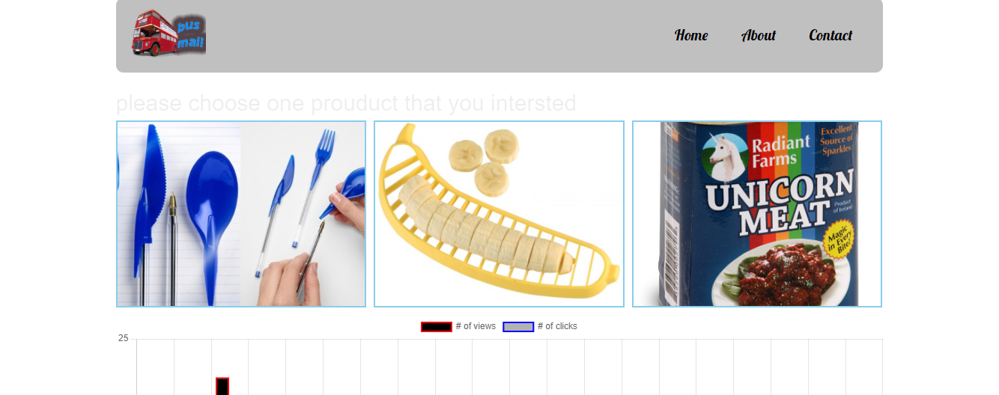
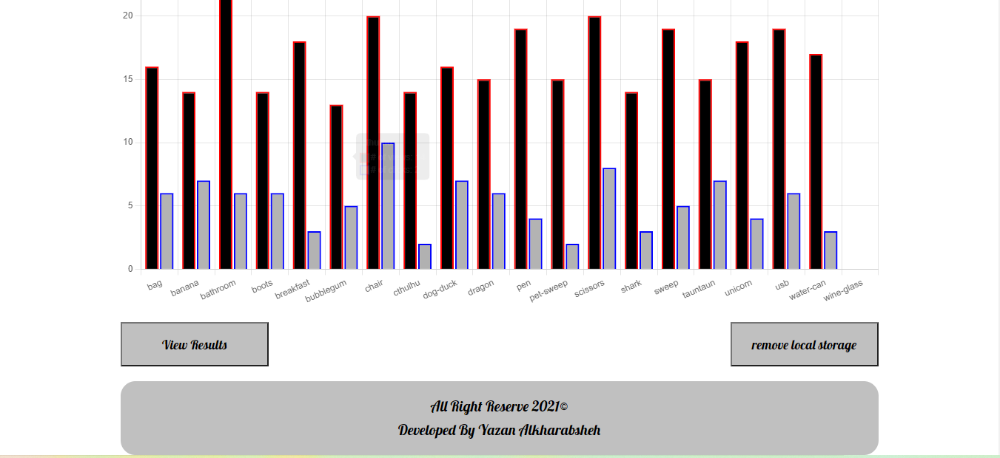

### **Salmoon Cockies**

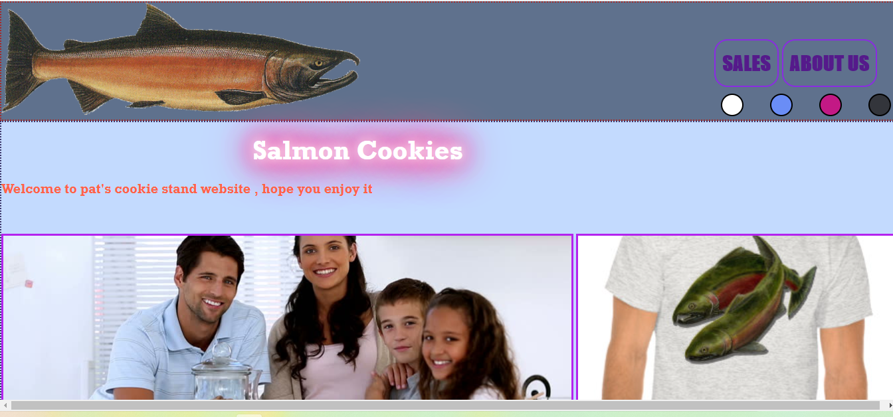
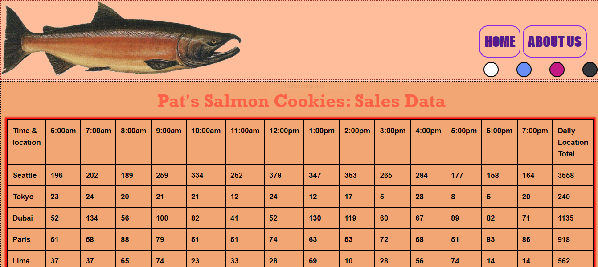
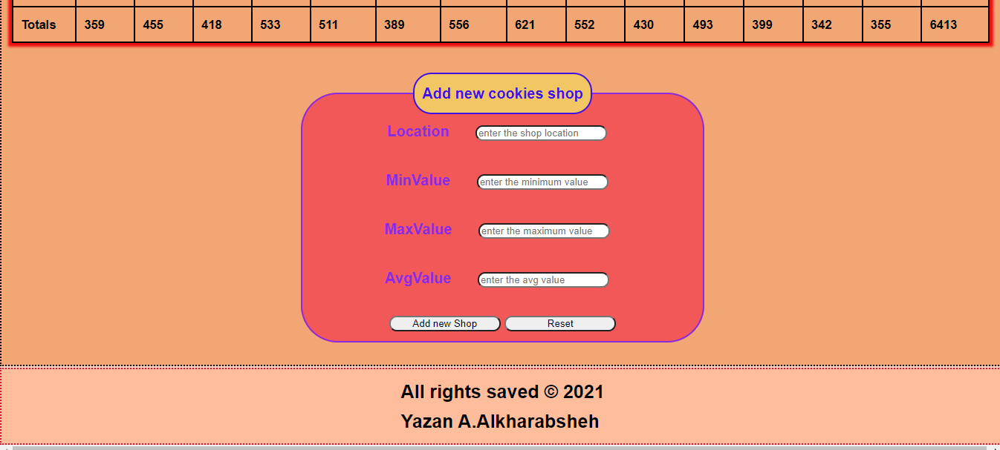
